---

```{r setup, include=FALSE}
knitr::opts_chunk$set(echo = TRUE)
```

# Dyplyr with Databases

This is a gentle introduction to using Dyplyr with an SQL database. The intent is to take you through each step including:

  1. What is a database?
  1. Why are they useful?
  1. What database programs are available?
  1. Which one will we use?
  1. Connecting to a database
  1. Querying data from a single table
  1. An example database and some of its tables
  1. Combining data from multiple tables in a single query
  
Don't worry if you don't know what all of these terms mean. I will be explaining them and guiding you through the process. There is quite a bit of introductory text before we get to code, but it covers a lot of conceptual material. I feel that understanding the context of databases and why you should use them is an important step in this journey.

# What is a database?

A database is a piece of software that stores data on your behalf and provides some guarantee about the integrity, durability, availability and consistency of your data. Different database provide different features and are used in different circumstances. This tutorial will cover the basics of a type of database called a relational database.

## What is a Relational database?
 
The core idea behind a relational database is (unsurprisingly) data relationships. The primary idea for relational data is to minimize data duplications by storing relationships between the data. For example, if you have four volunteers gathering samples for your expirement a relational database will not store their data in the same row as each sample. Rather, it will separate the data into two sets of records:

  1. The set of volunteers that participated.
  1. The samples that were collected.
  
```{r, out.width = "460px", echo=FALSE}
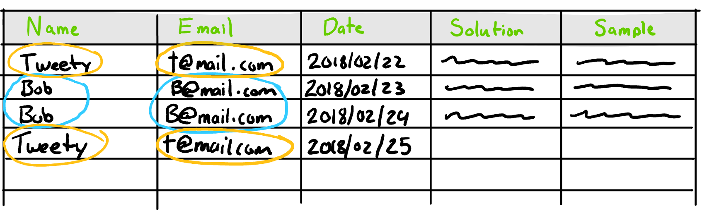
```
  
In order to know which sample was collected by which volunteer, a relationship between the two is included for each sample. Typically, this relationship takes the form of a unique identifier, like a student id. In our example, each volunteer is given a unique identifier which never changes and each sample stores the identifier of the person that collected it in a given column. If a volunteer updates their email addres, then only one row in the volunteer data set needs to change, rather than going through all samples and changing each row for that volunteer. Reducing redundency through the use of relationships is called database normalization [@wikipediadbnorm]. Normalizing a database results in many tables, each which store their information about a single type of record.

```{r, out.width = "460px",echo=FALSE}
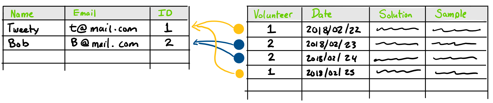
```

## Why use a relational database?

Relational database management systems are some of the most prevalent database systems in use today [@techrepublic2015].   They owe this popularity to three useful features. First, they provide a rich language with which to ask questions about the data. Second, they provide certain guarantees about how well they will keep your data around in the face of uncertain conditions.  Third, they provide facilities for quickly processing large amount sof data.

The rich language for querying the data is called the "Structured Query Language" or, SQL (pronounced sequel). This language was originally based on a branch of mathematics called relational algebra [@wikipediarelationalalgebra].  If you take a database course in the computer science department you can expect to learn quite a bit about relational algebra. We will be skipping the math and just using dplyr to access the data. 

For the data guarantees, most relational databases make these four guarantees in some fashion:

  1.  *Atomicity*: If you ask a database to store piece of data, it will either be stored in its entirety or not stored at all. This is an important property in the face of uncertain networking conditions.
  1.  *Consistency*: Only valid data will be written to the database. If you ask the database to store a date and time, it will only store a valid date and time. Invalid date and times will be rejected.
  1.  *Isolation*: If two users are asking for the  database to perform a series of operations, the all operations for each user happen in isolation. This is a more complex version of the *Atomcity* guarantee. It ensures that each users see the database in a consistent manner during their series of operations.
  1.  *Durability*: the data you put in them is durable in the face of hardware failure. If the power goes out, or the network goes down or the server crashes, they can guarantee that the data you have given them will still be there. Some guarantees cannot be provided. For example if the disk they use to store the data fails, they cannot keep this guarantee

Finally, they are able to provide quick, fast and accurate answers to certain types of questions. The query language is designed in such a way as to allow the database system to optimize the way it process the data.  A relational database understands the way its data is organized, and the type of data that it contains.  It uses this knowledge to optimize the way it processes data in order to quickly return the results.  When it is properly setup, this allows for every efficient querying of large datasets.For example, if you had a data set of the minute by minute conversion rates for US dollars to Canadian dollars for the past 100 years, it would contain over 50 million records. If you told the database that you are planning to frequently query for the conversion rates by month, then you could ask for the mean conversion rate for a random month  in the middle of 1934, and the database would be able to efficiently find those records for you without searching through all 50 million records. In contrast, doing something like this with spreadsheets would be very inefficient.
  

## Available databases

There are three primary choices for databases in dplyr. 

    1. MySQL
    2. PostgreSQL
    3. SQLite3
    
The first two are dedicated SQL servers. In order to use them they must be running as a separate application on your computer or on a server. In both cases, you must have a username and password in order to be able to connect to them. That's too much hassle for taking your first steps using database. I will be using SQLite3 for this tutorial in order to avoid those hassles.

SQLite3 is a free, open source database system that does not requires a separate application to be running. In contrast, you simply tell it the path to the file you'd like it to use and it will create and manage a database in that file for you. Even better still, dplyr and R provide a handy, easy to use database of baseball statistics in SQLite3. We will be using this database to demonstrate dplyr and databases.

# Dependencies

## dplyr 

Dplyr is a grammar of data manipulation. It is modeled after SQL and can be used on various data sources with ease. It's a great tool and learning to use it can help you make more efficient use of your time.

## RSqlite 

This package provides the SQLite3 facilities for R. dplyr uses it to access SQLite3. We won't be using directly, but you must have it installed in order for us to use the lahman database.

## Lahman
This package provides the baseball statistics. Everyone loves baseball, right?

You can install all of them using the following code snippets. Fair warning, installing dplyr is not a quick operation. It's not particularly slow, but you may as well go make yourself some tea. Besides, you'll need some caffeine for the next parts.

One thing to note is that if you have already installed dplyr before installing sqlite3 and the Lahman database, then you will need to uninstall dplyr first, and then re-install it again in this order.  Uncomment the following lines and use it to uninstall dplyr.

```{r remove dependencies, echo=TRUE, message=FALSE}
# if (require(dbplyr)) {
  # detach("package:dbplyr", unload=TRUE)
  # remove.packages("dbplyr")
# }
# if (require(dplyr)) {
  # detach("package:dplyr", unload=TRUE)
  # remove.packages("dplyr")
# }
# if (require(Lahman)) {
  # detach("package:Lahman", unload=TRUE)
  # remove.packages("Lahman")
# }
# if (require(RSQLite)) {
  # detach("package:RSQLite", unload=TRUE)
  # remove.packages("RSQLite")
# }
```


Some of these packages require compilation of code. Which may not be setup by default on your OS. I am not aware of a way to guarantee that the installation of the packages will work, but this order worked well for me.

```{r dependencies, include=TRUE, message=FALSE}
if(!require(RSQLite)) install.packages("RSQLite")
if(!require(dplyr)) install.packages("dplyr")
if(!require(dbplyr)) install.packages("dbplyr")
if(!require(Lahman)) install.packages("Lahman")
library(RSQLite)
library(dplyr)
library(dbplyr)
library(Lahman)
```
# Connecting to a database

dplyr provides three methods for connecting to each of the aforementioned database systems:

  1. `src_sqlite()`
  1. `src_postgresql()`
  1. `src_mysql()`

The dplyr documentation provides information for connecting to MySQL and PostgreSQL database. For SQLite3, the only argument necessary is the `path` argument. This path points to the file of an existing database or to a spot where you will create a new database.

Unlike MySQL and PostgreSQL which have much more complicated file formats which span multiple files and directories, SQLite3 keeps its data in a single file. This is very convenient at the sacrifice of slightly  reduced performance.  To be fair though, most of us are not going to be using datasets which are large enough to notice this reduced performance. If you are, then you'll probably need to collaborate with someone skilled at designing, deploying and configuring the database to run optimally. 

For the purposes of this tutorial, we can use a built in SQLite3 database. The `lahman_sqlite()` method will create an SQLite3 database and populate it with many years of baseball statistics on your behalf.

```{r database, echo=TRUE, message=FALSE}
db_connection <- lahman_sqlite()
```

# Querying data from a single table

Databases can contain many datasets.  Each data set is called a table and each table has name.  A table is loosely equivalent to a data frame, a tibble or (loosely speaking) a worksheet in an excel file.  The table consists of numerous data records and each record has the same set of fields. The fields have a name and can store a specific type of data.  We'll go into a bit more detail on tables and their organization later.

If this is the first time you are using a given data set, you can ask for information about which tables are available in a given database by using `print(db_connection)`. Doing this tells you which database you are connected to, and gives you a list of tables.
```{r db reference, include=TRUE}
print(db_connection)
```

Before we can ask dplyr to give us data from a table, we have to tell dplyr which tables we want to use.  We do this via the `tbl` function. This function takes the database connection as the first argument and the table name as the second.
```{r table reference, include=TRUE}
Batting <- tbl(db_connection, "Batting")
```
Note that all operations with dplyr and databases are lazy. This means that they do not fetch the data from the database until you ask to see the data or the results. This is important for performance.

The code above does not load the data from the database onto your computer. See appendix for more discussion of this. All it does is tell dplyr that you plan to ask for data from it, and gives you a variable you can use when you decide to query it.

## Exploring the structure of the table.

As an R user, you might be used to using the `str` function to determine the structure of an R object. In the case of tables we the output you get from this function call is not as useful. It does show some information, but it's not information about the structure of the data within the table.
```{r exploring the structure with str, include=TRUE}
str(Batting)
```

To get information about what sort of data is in the table, you can print it. With data frames and other base R objects, this might cause a lot of output, which is annoying. But with tibbles and tables, it's much better.

Tables and tibbles have a smart display system. When you ask to see or print them, they only show you the first 10 rows by default and only show you as many columns as they can fit on your screen at that time. Included for each column is its name and the type of data that it can store. After 10 rows, they then also show whether there are more rows available and the name and type of the remaining columns.
```{r exploring the structure, include=TRUE}
Batting
print(Batting) # Does the same thing
```


Each row in the `Batting` table contains information for each player's batting performance for a given year they played. Each columns are named after a relevant baseball statistic.

Asking for data using a database and dplyr uses the same syntax as use to ask for data from a data.frame or spreadsheet. We'll start simple. 

The structure of dplyr queries is: `<table> %>% <verb> %>% <verb> ...`. You first specify the table you want data from, then you specify a series of verbs that define the query. Each verb is separated by the `%>%` operator.


## select

The first verb we'll use is `select` which is a verb that specifies which columns you would like to have in your results.

Let's ask for all player ids with the year and the number of runs batted in (RBI):
```{r using select, include=TRUE}
Batting %>% select(playerID, yearID, RBI)
```

## filter

`filter` is a verb that filters the records (rows) you received based on some criteria. 

Example, let's ask for everyone that has had exactly 13 RBIs in a season:
```{r using filter #1, include=TRUE}
Batting %>%
  select(playerID, yearID, RBI) %>% 
  filter(RBI == 13)
```

Example, let's ask for everyone that has had more than 170 RBIs in a season:
```{r using filter #2, include=TRUE}
Batting %>%
  select(playerID, yearID, RBI) %>% 
  filter(RBI > 170)
```

Example, let's ask for everyone that has had more than 100 RBIs and 200 Strikeouts (SO) in a season:
```{r using filter #3, include=TRUE}
Batting %>%
  select(playerID, yearID, RBI, SO) %>% 
  filter(RBI > 100 & SO > 200)
```

Be careful of the order of these verbs. If you use `select` to change which data that you'll be using, then other columns may not be available in your filter. For example, if you delete the `SO` in the `select` call above, the query will fail.

```{r using filter #4, include=TRUE, eval=FALSE}
# This one doesn't run!
Batting %>%
  select(playerID, yearID, RBI) %>% 
  filter(RBI > 100 & SO > 200)
```

## arrange

`arrange` is a verb that changes the order of the data that you are receiving.

Example, let's find the players with the most strikeouts in a season:
```{r using arrange #1, include=TRUE}
Batting %>%
  select(playerID, yearID, SO) %>% 
  arrange(SO)
```

Whoops. Something went wrong. Our data only included NA values for SO. This is because relational databases allow for data to be NA, just like R!  They use the term `NULL` instead of NA, but the concept is the same. It means the data is missing.

Let's try that again and this time filter out NA data
```{r using arrange #2, include=TRUE}
Batting %>%
  select(playerID, yearID, SO) %>% 
  filter(!is.na(SO)) %>% 
  arrange(SO)
```

Whoops, we got rid of the NAs, but we're getting 0 values now. This is because we sorted in the wrong order. In order to reverse the order, you use the `desc` verb around the column name within the `arrange` call. `desc` stands for descending order. The largest ones come first, exactly what we want.
```{r using arrange #3, include=TRUE}
Batting %>%
  select(playerID, yearID, SO) %>% 
  filter(!is.na(SO)) %>% 
  arrange(desc(SO))
```

We can also find out which players have the most homeruns (HR) in a season:
```{r using arrange #4, include=TRUE}
Batting %>%
  select(playerID, yearID, HR) %>% 
  arrange(desc(HR))
```

One thing to notice here is that we didn't have to filter out NA values. This is because NA values are considered to be less than all other values. So they show up near to the lowest values and we asked for the largest values to come first.

## group_by and summarise

These two functions go hand in hand. They are almost always used in concert with each other and for good reason.  Up until now, we have been getting each record as an individual result.  group_by and summarise allow us to group the records together by a common attribute and then summarise the data within each group. These are best demonstrated with some examples.

Who has played the most games (G) as a batter in their career?
```{r most games, include=TRUE}
Batting %>%
  group_by(playerID) %>% # Take all records for each player and group them together
  summarise(total_games = sum(G, na.rm=TRUE)) %>% # sum the number of games for each group and call it "total_games"
  arrange(desc(total_games)) %>%  # We can refer to columns created in a summarise in later verbs
  select(playerID, total_games) 
```

Who has the most home runs (HR) as a batter in their career?
```{r most home runs, include=TRUE}
Batting %>%
  group_by(playerID) %>%
  summarise(total_HR = sum(HR, na.rm=TRUE)) %>%
  arrange(desc(total_HR)) %>%
  select(playerID, total_HR) 
```

Who has the most home runs (HR) per game played a batter in their career?
```{r most home runs per game, include=TRUE}
Batting %>%
  group_by(playerID) %>%
  summarise(
    total_HR_per_game = (sum(HR, na.rm=TRUE)+0.0) / (sum(G, na.rm=TRUE)+0.0),
    total_HR = sum(HR, na.rm=TRUE),
    total_G = sum(G, na.rm=TRUE)
  ) %>%
  arrange(desc(total_HR_per_game)) %>%
  select(playerID, total_HR_per_game, total_HR, total_G) 
```

Some notes on that one. If the column you are using stores whole numbers then databases will do division using whole numbers. This means that 1/3 will be 0. Not 0.33. This is somewhat confusing at first, but the idea is that databases will try to ensure that the type of data you are using is consistent, unless you explicitly ask them to convert it.

To convert the total games played and total home runs to a real number I used a trick. Simply add 0.0 to the number. This causes the database to change the type of each sum to a real number and then the result of the division is also a real number.  

Also, as expected the people with the highest home runs per game are the ones that managed to hit a few home runs in a few games.  We're more interested in people who played more games than this.  So how can we do that?  Let's filter by `total_G`:
```{r most home runs per game with 2000 games played, include=TRUE}
Batting %>%
  group_by(playerID) %>%
  summarise(
    total_HR_per_game = (sum(HR, na.rm=TRUE)+0.0) / (sum(G, na.rm=TRUE)+0.0),
    total_HR = sum(HR, na.rm=TRUE),
    total_G = sum(G, na.rm=TRUE)
  ) %>%
  arrange(desc(total_HR_per_game)) %>%
  filter(total_G > 2000) %>% 
  select(playerID, total_HR_per_game, total_HR, total_G) 
```

Dplyr is really flexible in how it lets us combine the verbs to get the data we want. It's great. Databases are fast at doing these sorts of calculations for you, so the results are returned quickly as well.

## Conclusion

Querying a single database table using dplyr is almost identical to using dplyr for processing data from a spreadsheet.  This is the beauty of dplyr and why I feel it is such an important tool in the toolbox of an R programmer.  Using dplyr allows you to concisely describe the data you want and to have it retrieve that data efficiently no matter then data source.

# Queries involving multiple tables.

Using dplyr to ask for data from multiple tables is almost as easy as asking for data from a single table. The primary difference is that you have to specify all of the tables involved and you need to tell dplyr how to combine the information from the tables.  This sounds simple and in many ways it is simple. The resulting code will not be overly complex. However, understanding the relationships in the data and the options you have to combine them is not always intuitive at first.

## Narrow format vs wide format

Relational databases store their data in a wide format.  The following figure is an example of wide format data.
```{r, out.width = "260px", echo=FALSE}
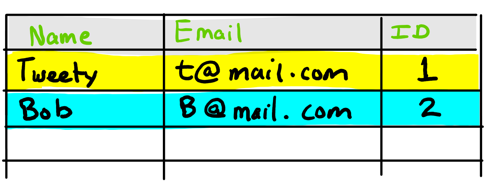
```

In a wide format system, each row represents a single record within the table.  That means that as more and more fields are added to the records, you get more and more columns added to the table. In the above example, there are two rows which represent two records.

This is in contrast to a format called narrow format, in which each row represents a single field of data for a given record.  In order to find all of the fields for the record, you have to go through multiple rows. Using the same example data as the previous figure, this is an example of narrow format:
```{r, out.width = "260px", echo=FALSE}
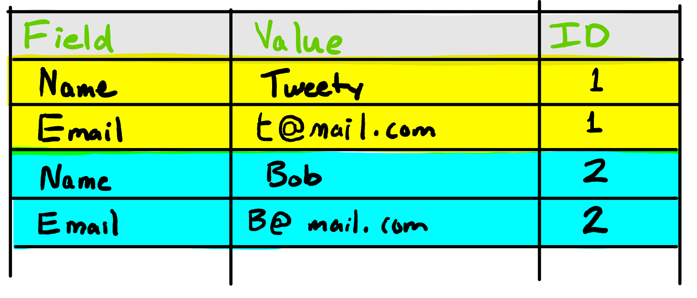
```

It's helpful to imagine the data in a wide format when thinking about how to query tables with dplyr.  For example, when you are filtering data, you can picture the database looking at each row and either including it or discarding it based on the criteria specified in the filter. Understanding wide format data is also important to understanding how to combine data from multiple tables.

## Tables
As discussed in the introduction, database have usually undergone a database design process called data normalization [@wikipediadbnorm].  This process results in many tables within the database where each table contains records of a particular type. The exact manner in which the records are organized is usually chosen to support certain types of queries. For example, in our database about baseball some tables organized around batting and some around pitching. Each record within the table represents the statistics for a given player for a given year. This format was chosen to allow for easy manipulation of the data year over year.

In a database that needs to do more in depth analysis, you might find that the records are stored for a given player by game they played or by inning they played.
  
## Relationships
The relationships between the database tables may not always be clear at first glance. In fact, given a database of sufficient complexity and size it can be difficult to take into account all possible relationships at once. As you spend more and more time with a given database you will begin to familiarize yourself with its structure and therefore how to properly query it and its relationships.

## Combining data from multiple tables
In a relational database, you often need data from multiple tables. To better understand this we will use a toy example to explain. Consider two tables. One contains information about people, like their name. The second contains their email addresses. Each email address record also contains a column that specifies which person the email address belongs to. Here is a figure showing this situation and showing some example data:
```{r, out.width = "300px", echo=FALSE}
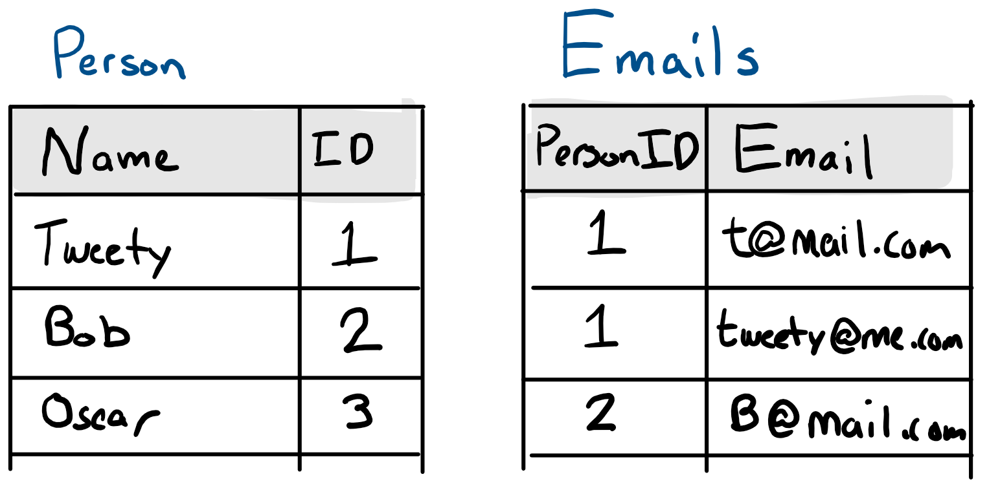
```

dplyr provides 6 different join mechanisms. However, we will only discuss 3 to illustrate some of their primary differences. Each type of join operates on 2 tables. The way it combines records from each table is the difference. In addition to operating on two tables, you can also specify the column you would like to use to match up rows from each table.  If you do not specify a column, dplyr will automatically attempt to determine the appropriate column for you. I would not recommend depending on this behavior. It is better to understand which column you are using for the relationship and to specify it explicitly.  In the above data example, the column we will join on is the "ID" column. 

### Inner Joins
The first type of join is called `inner_join`.  This type of join only takes records which have a match. This means that it will include any person record that has an email and vice versa.

These records have a match:
```{r, out.width = "300px", echo=FALSE}
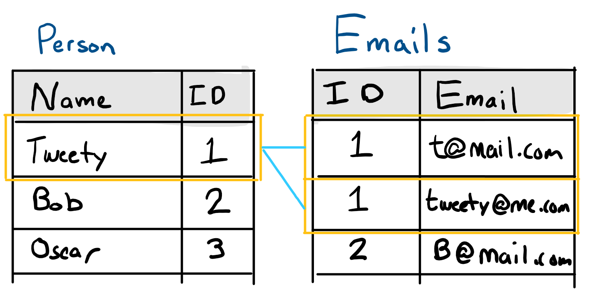
```

So do these:
```{r, out.width = "300px", echo=FALSE}
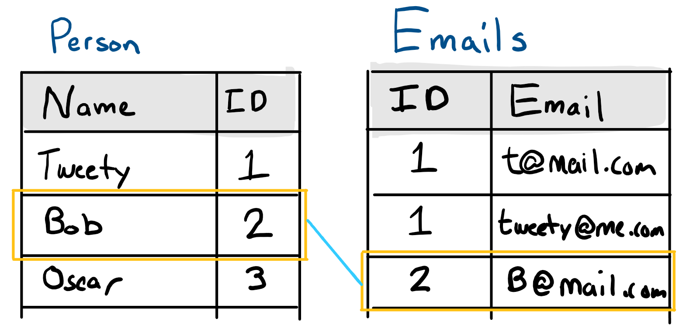
```

The third person record does not have a match and will therefore be excluded from the results
```{r, out.width = "300px", echo=FALSE}
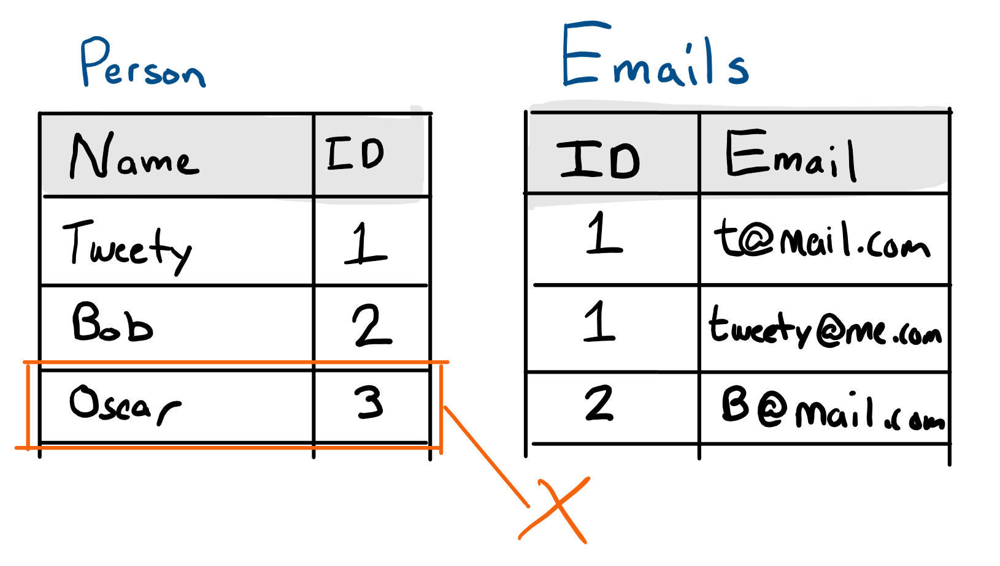
```

However, you've probably noticed that the first person record has two emails. So how does the database resolve this situation?  The key to understanding this is understanding the wide format.  The results that the database will return are in a wide format. This means that each row must be a complete "result" record by itself.  In order to accomplish this, the database will copy repeat the data from the side with less results to ensure that each rows has the complete data.

The results of the above inner join, look like this:
```{r, out.width = "300px", echo=FALSE}
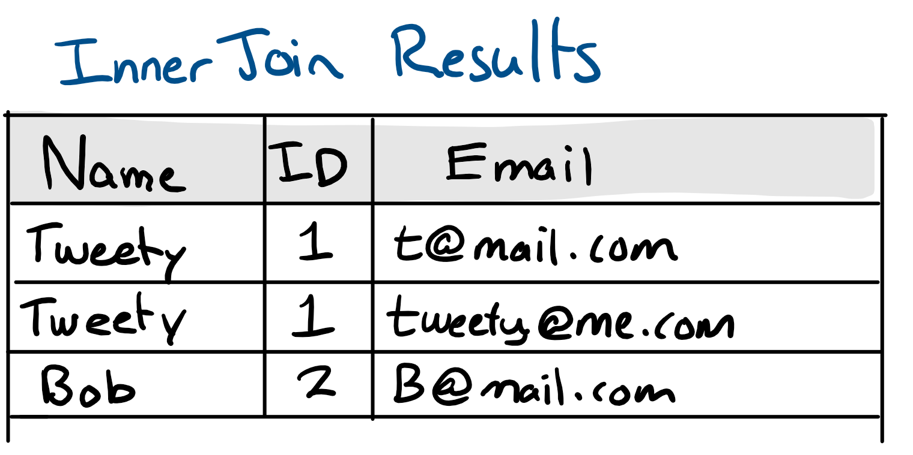
```

#### an example inner join using our baseball data
To illustrate this, let me explore the data and find a player that has multiple batting records and multiple hall of fame records:
```{r inner join example, include=TRUE}
Pitching = tbl(db_connection, "Pitching")
HallOfFame = tbl(db_connection, "HallOfFame")

# Find players with two times on the ballot
HallOfFame %>%
  mutate(one=1) %>% 
  group_by(playerID) %>%
  summarise(total_appearances=sum(one)) %>% 
  select(playerID, total_appearances) %>% 
  filter(total_appearances==2) %>% 
  pull(playerID)

# Double check that this player batted more than once.
Batting %>% filter(playerID=="adamssp01" & yearID %in% c(1922, 1923))

# use an inner join and see that 4 records are returned
HallOfFame %>%
  inner_join(Batting, by="playerID", suffix=c(".hf", ".ba")) %>%
  filter(playerID=="adamssp01" & yearID.ba %in% c(1922, 1923)) %>%
  select(playerID, yearID.hf, G, yearID.ba)
```

Note that there are 4 records returned. This is because the database returns all unique combination of records from both sides.  If you want to ensure you don't get duplicate data like this, you must ensure that one side has only one record that matches.

### Left and right joins
Two other types of joins are the left and right join. They are mirrors of each other so I will only show an example of a left join. The right join does the same thing but switches which tables are included.

A left join will always include all records that match your filter, regardless of whether they have a match on the table on the right.  In dplyr, joins are specified like so: `LeftTable %>% left_join(RightTable)`. 

In the case that there is no matching record from the right table we still need to have a complete record in order to satisfy the wide format. Therefore any columns that are missing in that record will be filled out with an NA value.
```{r, out.width = "300px", echo=FALSE}
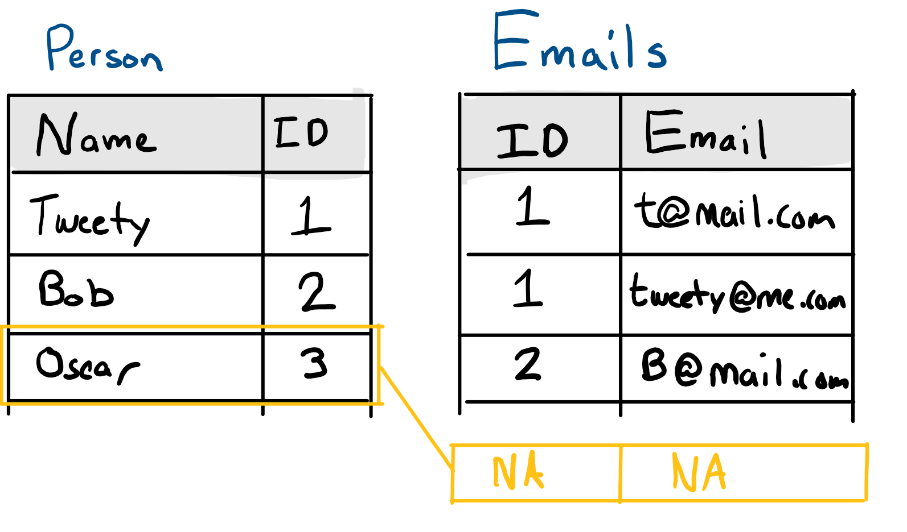
```

Using the same data as above, the results of a left join will look like this:
```{r, out.width = "300px", echo=FALSE}
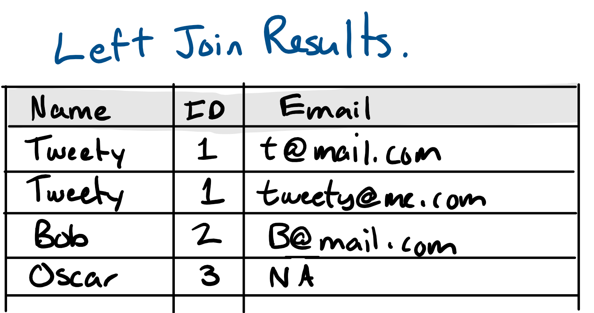
```

#### an example of a left join using our baseball data
Let's find out the hits Peter Rose had in regular season and post season per year. Note that in this case we will need to join by multiple columns (playerID and yearID). Also note that both tables contain columns with the same name. In that case, you can pass a `suffix=` parameter to the join to tell it to suffix those names and then you can refer to the fields from one table or the other explicitly. Note that columns that you included in the join do not need to use this suffix. By definition, they have the same value. 
```{r left join example, include=TRUE}
Batting = tbl(db_connection, "Batting")
BattingPost = tbl(db_connection, "BattingPost")

# use left join
Batting %>%
  left_join(BattingPost, by=c("yearID", "playerID"), suffix=c(".regular", ".postseason")) %>%
  filter(playerID=="rosepe01") %>%
  group_by(yearID) %>% # Group it by year
  summarise(
    playerID=playerID,
    regularH=H.regular,
    yearID=yearID,
    postH=sum(H.postseason, na.rm=TRUE)
  ) %>% 
  select(playerID, yearID, regularH, postH)
```

### Other types of joins
dplyr provides 6 verbs for combining data from multiple tables.  We have only covered three of them. Each differ slightly in how the handle matches and missing data, etc. For further information on the different types of joins and how to use them, see the chapter on relational data from the R for Data Science book: http://r4ds.had.co.nz/relational-data.html


## Example Queries with 2 tables
Without further ado, let's jump into some example questions we might want to answer about the baseball databases. In each of the following examples, I will pose a question that requires multiple tables to answer it. Then I will take you through how I solve it step by step.  Each time a new concept is introduced I will explain it in brief. 

### Which Hall of Fame player has the most strikeouts?

To answer this question, I'll need information about players and their batting statistics. I will also need information about who is in the hall of fame.  Luckily the Lahman database provides both of these. We have already used the Batting table, but we haven't used the HallOfFame table. Let's get a reference to it, and let's explore it's data types.

```{r most strikeouts hall of fame exploration, include=TRUE}
Batting = tbl(db_connection, "Batting")
HallOfFame = tbl(db_connection, "HallOfFame")
print(HallOfFame)
```
By looking at its columns and their types it becomes obvious that this table contains a record for everytime there was a vote about a particular player entering the hall of fame. This means that if someone was voted into the hall of fame on the first try then they have a single record in the table and the `inducted` field is set to "Y". If they were inducted after multiple votes then they have multiple records. If they were not inducted, but still made it onto the ballot then they will have a record for each time they were on the ballot, but the `inducted` field will be set to "N"

We can also notice that it includes a field called `playerID` which is same as the Batting table. Tables that have common fields like this can be joined. We can use this column to join the tables.

The join we will use for this query is `inner_join`. The syntax is `inner_join(HallofFame, Batting, by=playerID')`. This asks the database to combine the records based on the value of the `playerID` column. The database will give us records from both tables, but only when they both have the same playerID value.

In the case of the `HallOfFame` table, it includes records for every player that was on a Hall Of Fame ballot vote.  The Batting table contains records for each player for each year where they batted during the season. 

For players that never were eligible for the Hall of Fame, they will be excluded from this join because they don't have a matching record in the `HallOfFame` table.  Same goes with players that never batted. However, if a player is in the HallOfFame and they batted during their career then they will have at least one record. The exact number of records that are included is the number of times that they appear in the `HallOfFame` table multiplied by the number of times they appear in the `Batting` table.

The primary take away is that we need to filter the `HallOfFame` table by the `inducted` column. A player can only be inducted once. This means we will only get one matching record from the `HallOfFame` table and it will be combined with each matching record from the Batting table. We can then use the `group_by` and `summarise` columns to calculate the stats we want.

Let's try it out:
```{r most strikeouts hall of fame batter, include=TRUE}
HallOfFame %>%
  inner_join(Batting, by="playerID") %>% # Make the join so we get all of the data
  select(playerID, SO, inducted) %>% # Select the columns we are interested in
  filter(inducted=="Y") %>% # filter to only those inducted in the hall of fame
  group_by(playerID) %>% # Group it by player
  summarise(total_SO=sum(SO, na.rm=TRUE)) %>%  # Sum the strikeouts
  arrange(desc(total_SO)) # Sort by strike outs descending
```

To check our answer we can look at wikipedia:  https://en.wikipedia.org/wiki/List_of_Major_League_Baseball_career_strikeouts_by_batters_leaders

Reggie Jackson is top of the list, just like our results.  Jim Thome is second on the list, but was elected into the Hall of Fame in 2018. The Lahman database hasn't been updated to include that yet.

### Which Hall of Fame Pitcher has the most Strikeouts?
```{r least strikeouts hall of fame pitcher, include=TRUE}
Pitching = tbl(db_connection, "Pitching")
HallOfFame = tbl(db_connection, "HallOfFame")
HallOfFame %>%
  inner_join(Pitching, by="playerID") %>% # Make the join so we get all of the data
  select(playerID, SO, inducted) %>% # Select the columns we are interested in
  filter(inducted=="Y") %>% # filter to only those inducted in the hall of fame
  group_by(playerID) %>% # Group it by player
  summarise(total_SO=sum(SO, na.rm=TRUE)) %>%  # Sum the strikeouts
  arrange(desc(total_SO)) # Sort by strike outs descending
```

Once again, wikipedia provides quick verification that we have the right answer - https://en.wikipedia.org/wiki/List_of_Major_League_Baseball_career_strikeout_leaders

## Conclusion.
Querying data from multiple tables is very easy in dplyr. The code is concise and it runs quickly. It takes some practice to learn how to formulate your questions in terms of the verbs that dplyr provides, but the payoff is a rich query language that operates on multiple data sources.

I hope you have enjoyed this introduction to dplyr with databases. It's only the tip of the iceberg. There is so much more to systems that work like this. I would encourage you to go read about the other verbs and joins that dplyr provides and to play around with a data set like this. It's an invaluable skill.


# Appendix 1. Installing PostgreSQL - A few notes

In a real world scenario you will likely be using something other than SQLite3. If you'd like to explore that option, then I recommend using PostgreSQL. It's a great database with a great set of features and rock solid stability and durability. If you are working for a company that has pre-existing database infrastructure you would work with their IT department to get access to the database.  If you are interested in installing one of these for learning purposes, there are two ways I recommend setting this up:

  1. Installing it on your machine. If you plan to use PostgreSQL for longer term, this is a solid option. Use the following installer: https://www.enterprisedb.com/downloads/postgres-postgresql-downloads
  2. If you just plan to try it out in the short term, you can try out a free postgresql database from Heroku, a cloud service provider. Sign up, use the control panel to setup a developer database and then plug the credentials they gave you into the `src_postgresql` function call from dplyr.. 
  3. If you run Ubuntu or another form of linux, you can be certain that the included package manager will include PostgreSQL and that this is the easiest way to install it.
  
# Appendix 2. Networking and databases

In a real world scenario, you will often be connecting to a database that runs on a server. This means that anytime you request data from the database, the request has to be sent to the server, the server then processes the request and then sends you back the data.  If you ask for a lot of data, then the network aspect of this operation can slow down the results significantly.

dplyr, like most good database software is lazy. It does not immediately go and fetch information from the database and transfer it to your computer. It does this only when absolutely necessary. This means that when you first connect to the database, or ask for a reference to a table, you are not transferring the data across the network. It's important to keep this in mind when working with databases and dplyr.

# References
