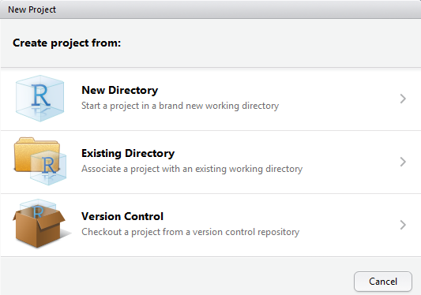

## Why build your own?

1. **make your own work more efficient**
2. code portability
3. help others
4. code performance
5. code testing

## Building R packages is easy^\*^...

```{r, echo=FALSE, fig.align="center", out.width="300px"}

```

...building high quality, robust, optimized, ones is harder.

But that's true of code in general!

## Writing a high quality package

### Good code

- behaves correctly (does the thing it says it does)
- modularize your code for re-use
- functions shouldn't have side-effects
- don't write system-specific code (e.g., file paths)

### Good documentation

- each function, object, dataset, etc. should be documented
- [`roxygen2`](https://cran.r-project.org/package=roxygen2) facilitates writing documentation *with* code
- reproducible examples for most functions
- vignettes can serve as longer-form documentation of tasks/workflows

## Package development with Rstudio

RStudio IDE makes package development simple and accessible to beginners

[http://www.rstudio.com/products/RStudio/](http://www.rstudio.com/products/RStudio/)
 
### Prerequisites

- Rtools (if using Windows)
- XCode development tools (if using OSX)
- `r-base-dev` (if using Debian-based Linux)
- see [here](https://support.rstudio.com/hc/en-us/articles/200486498-Package-Development-Prerequisites) for more details

### Getting started:

```{r, eval=FALSE}
install.packages(c("devtools", "roxygen2", "testthat", "knitr"))
devtools::has_devel() ## TRUE
```

## The R package bible

```{r, echo=FALSE, fig.align="center", out.width="300px"}
knitr::include_graphics("images/rpkgs-book.png")
```

<div class="centered">
  [http://r-pkgs.had.co.nz/](http://r-pkgs.had.co.nz/)
</div>

# Let's build a package!

## Naming your package

### Requirements

1. can only consist of letters, numbers and `.`;
2. must start with a letter;
3. cannot end with `.`.

### Suggestions

1. should be unique (see [available](https://cran.r-project.org/package=available) package);
2. should be evocative of its function.

## Getting started with RStudio {.flexbox .vcenter}

Create a new Rstudio project...



## Getting started with RStudio {.flexbox .vcenter}

Create a new package ...


## Getting started with RStudio {.flexbox .vcenter}

Where should the new package be created?


# Anatomy of a package

## Package directory structure

<div class="columns-2">
  **The essentials**
  
  - `DESCRIPTION`: package metadata
  - `NAMESPACE`: namespaces
  - `NEWS`: overview of version changes
  - `man/`: documentation
  - `R/`: R code files
  - `vignettes/`: vignettes
  - &nbsp;

  **Other components**
  
  - `README`: human readible package information
  - `data/`: data
  - `inst/`: installed files
  - `src/`: compiled code (*e.g.*, using [`Rcpp`](https://cran.r-project.org/package=Rcpp))
  - `tests/`: testing
</div>

## Package information

### The `DESCRIPTION` file

- package metadata (authors, version, dependencies, etc.)
- what does the package do?

### The `NEWS` file

- describes what's new in each version

### The `README` file

- how to start using your package
- what are the important functions?
- can double as a webpage on GitHub

## Including data in your package

```{r, eval=FALSE}
devtools::use_data(...)
```

If you include data, be sure to also document it!

http://r-pkgs.had.co.nz/data.html#documenting-data

**NOTE:** CRAN packages are limited to a size of ~5MB

## Package documentation {.flexbox .vcenter}

Go to *Tools* > *Project Options* > *Build Tools*


## Package documentation {.flexbox .vcenter}

We will use `roxygen2` to automatically build all documentation and `NAMESPACE` files.


## Package documentation

- write object documentation alongside your code (`roxygen2`);
- long form "how to" doucmentation can be written as `.Rmd` vignette files and placed in `vignettes`.

```{r, eval=FALSE}
devtools::use_vignette("name")
```

## The `fpCompare` package

[github.com/PredictiveEcology/fpCompare](https://github.com/PredictiveEcology/fpCompare)

```{r echo=TRUE, eval=FALSE}
#install.packages("fpCompare")
library(fpCompare)
browseVignettes("fpCompare")
```

## The `meow` package

[github.com/achubaty/meow](https://github.com/achubaty/meow)

```{r, echo=TRUE, fig.height=4, fig.width=5}
#install_github("achubaty/meow")
library(meow)
meow()
```

## Developing your package

- local development

```{r eval=FALSE}
devtools::dev_mode()
devtools::load_all()
```

- local build / install

```{r eval=FALSE}
devtools::build()
devtools::install()
```

## Testing your code (1)

- make sure your code does error checking

    - *e.g.*, check that inputs are of the correct type, non-`NA`, etc.
    - use formal class definitions (*e.g.*, `S4` objects)

- always write examples for your functions

    - part of the documentation

- write unit tests for each of your functions

```{r eval=FALSE}
devtools::use_testthat()
```

## Testing your code (2)

- run unit tests (`devtools::test()`)
- use `R CMD check` to check for common errors

    - mandatory for CRAN submission (very strict!)
    - `devtools::check()` to run checks locally
    - `devtools::check_win()` to run checks on win-builder
    - [`rhub`](https://cran.r-project.org/package=rhub) package for testing on more systems
    - automated building/checking

# Best practices

## Use version control

### `git` and GitHub

```{r echo=FALSE}
htmltools::img(src = "images/GitHub-Mark-64px.png", 
               alt = "GitHub logo", 
               style = "position:absolute; top:0; right:0; padding:10px;")
```

- tracks all your code changes over time
- roll back to previous versions as needed
- facilitate collaboration
- public or private repositories available
- built-in issue tracker
- free website for your package (*e.g.*, using [`pkgdown`](https://cran.r-project.org/package=pkgdown) package)
- develop code on separate 'braches' --> test --> merge --> publish
- integration with automated testing services
- several good GUIs available (GitKraken, GitHub Desktop) + Rstudio

## Use automated testing

- Testing on Windows `devtools::use_appveyor()`
- Testing on Linux / macOS `devtools::use_travis()`


## Use automated coverage checking

- *E.g.*, `devtools::use_coverage(type = "coveralls")` 


## Distributing your package

- RStudio's *Build Source Package* and *Build Binary Package*
- GitHub repository:

```{r eval=FALSE}
install_github("achubaty/meow")
```

- submit to CRAN (be sure to have a look at [Writing R Extensions](https://cran.r-project.org/doc/manuals/r-release/R-exts.html))

```{r eval=FALSE}
install.packages("fpCompare")
```

- also, [`drat`](https://cran.r-project.org/package=drat) and [`miniCRAN`](https://cran.r-project.org/package=miniCRAN)

## Updating your package

- update `DESCRIPTION`
- update `NEWS`
- re-run all checks
- run reverse dependency checks (`revdep_check()`)
